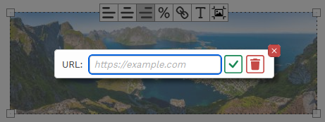
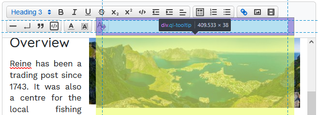
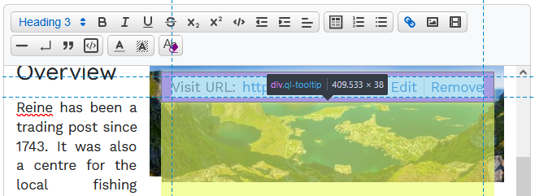

# Quill Blot Formatter 2 (quill-blot-formatter2)

> [!WARNING]
> ***THIS README IS FOR THE 3.0.0-beta ONLY - see the [readme](https://www.npmjs.com/package/@enzedonline/quill-blot-formatter2?activeTab=readme) on NPM for the v2.x readme***


An update of [quill](https://quilljs.com/) module [quill-blot-formatter](https://github.com/Fandom-OSS/quill-blot-formatter) to make alignments compatible with Quill V2. Out of the box supports resizing and realigning images and iframe videos. For images, it supports link management and editing alt & title values. It can be easily extended using [`BlotSpec`](#blotspec) and [`Action`](#action).


> [!IMPORTANT]
> Before using this package, it's recommended to at least be familiar with the information covered in [Actions](#actions), [CSS](#css) and [Options](#options). If your Quill editor is scrollable, be sure to also read the notes in [Scrollable Editors](#scrollable-editors).
<hr>

> [!WARNING]
> This package has been designed for, and tested with, the native Quill editor. It has **not** been tested with the Quill wrapper packages for Vue or Angular. If you use these packages and encounter a problem, I welcome fully tested PR's that will address the issue, but I cannot support each and every one of these. If you do get it to work with these packages and have some tips on the subject, I'm happy to include those here also.
<hr>

> [!CAUTION]
> Note that BlotFormatter2 ***is NOT*** compatible with React wrapper library (`react-quilljs`). See [Demos](#demos) below for a working example using the native Quill object with Blotformatter2 and React.
<hr>

## Contents

- [What's New](#whats-new)
- [Installation](#installation)
- [Usage](#usage-examples)
  - [Node.js / CommonJS](#nodejs--commonjs)
  - [ESM (React, Next.js, Angular, Vue, Vite, etc.)](#esm-react-nextjs-angular-vue-vite-etc)
  - [Angular](#angular)
  - [React / Next.js](#react--nextjs)
  - [Script Module](#esm-in-a-script-typemodule-browser)
  - [Script Tag](#umd-in-a-script-tag-browser)
  - [Registering Blotformatter with Quill](#registering-blotformatter-with-quill)
  - [Using Suggested Align Format Styling](#using-suggested-align-format-styling)
    - [via CDN](#via-cdn)
    - [via import](#via-import-react-etc)
  - [Demos](#demos)
- [Actions](#actions)
  - [Align Action](#align-action)
  - [Resize Action](#resize-action)
    - [Using Relative Sizes](#using-relative-sizes)
    - [Resizing on Touch Screens](#resizing-on-touch-screens)
  - [Delete Action](#delete-action)
  - [Attribute Action (alt/title editing)](#attribute-action-image-blots-only)
    - [Using the title as caption](#using-the-title-as-caption)
  - [Compress Action](#compress-action-embedded-image-blots-only)
- [Included Custom Blots](#included-custom-blots)
  - [Image](#image)
  - [Video](#video)
- [Formatting Images](#formatting-images)
- [Formatting Videos](#formatting-videos)
- [CSS](#css)
  - [Suggested CSS](#suggested-css)
  - [Consideration for modal forms](#modals)
  - [Conditional Styling for Responsive Sites](#conditional-styling-for-responsive-sites)
- [Quill Bug Fixes](#quill-bug-fixes)
  - [registerArrowRightFix](#registerarrowrightfix)
  - [containTooltipPosition](#containtooltipposition)
- [Scrollable Editors](#scrollable-editors)
- [Toolbar](#formatter-toolbar)
- [Configuring Options](#configuring-options)
- [Further Customisations](#further-customisations)

## What's New

### Version 3.0
 > [!CAUTION]
 > While there are minor changes to functionality with this release, there are significant changes under the hood, and changes to the build paths. If you are upgrading and have significant modifications in place with this package, test thoroughly before putting in production. This is particularly the case if you have modified the align format attributor classes. 
 - ***ESM (es2022) build output now available as `index.ems.js`.***
 - ***UMD build is renamed to `index.js`. See [Installation](#installation) for details.*** 
 - Corresponding map files are now output for each build and code has been doc-stringed throughout to ease developing / extending the BlotFormatter.
 - Project is now compiled with vite, webpack has been discontinued.
 - Internal references to the global Quill object have been replaced with the quill instance contructor. This *should* resolve issues in previous releases when using the React Quill wrapper, or with Angular & Vue.
 - Debugging is now available by setting option `debug: true` - this is a verbose mode with output to the debug console.
 - Formatter toolbar will now scroll into view in most cases if hidden when activating formatter overlay.
 - Optional Quill tooltip fix will contain Quill's native tooltip within the bounds of the Quill editor element. This is intended for use on scrollable editors where Quill will display the tooltip outside if this rectangle in some cases causing clipping.

### Version 2.4

**New actions added:**

- **Link Action** allows editing of hyperlinks on images directly from the formatter toolbar. [More info](#link-action)
- **Caret Action** introduces deselecting the formatter using left/right arrows and places the cursor in the corresponding editor location before or after the image. [More info](#caret-action)

**Other improvements:**

- Toolbar buttons now have tooltips (via `title` attribute). Configurable via options: `toolbar.tooltips`. Each key should match the corresponding action name. See [DefaultOptions](./src/DefaultOptions.ts) for examples.
- Toolbar button active styling is now configured via options  `toolbar.buttonSelectedStyle` and `toolbar.buttonSelectedClassName`
- Changed the behaviour of deselecting from mouse click so that if clicked directly to the left or right of the overlay, caret will be placed in the previous/next position.
- Improved default styling for the Alt/Title modal form.

### Version 2.3

Functionality, this was a minor update that allows empty `alt` tags on images. Previouusly these were removed if encountered.

This version saw upgrades to dependencies and target compiler module: `tsconfig.compilerOptions.module` updated from `commonjs` to `es2022`. 

### Version 2.2

This release is a major rewrite, including: 
- support for mobile/touch screens (including resize by pinch gesture)
- relative sizing vs absolute (% vs px), option to use on all resize actions or change on a per blot basis via toolbar button
- size information inlay for accurate sizing and interactive feedback during resize
- support for scrollable editors
- many fixes for bugs carried over from original `blot-formatter` package


#### Version 2.2.2
- compress action was added to reduce the size of embedded images if applicable
- an optional `imageOversizeProtection` setting for the Resize Action prevents images from being sized larger than their natural size when using absolute sizes


See [change log](CHANGELOG.md) for full details.

### Version 2.1

This release adds alt and title editing support for images. Look for the **`T`** button next to the alignment buttons on the overlay toolbar.

Clicking the **`T`** button will open a modal form to add your values.

<p align="center">

 

</p>

Using the [suggested css](#suggested-css), the title can also be used as a caption on your images.

<p align="center">


</p>

See notes below on usage, css and importantly, [supporting image titles in Quill](#alt-text-and-title-editing).

## Installation

> [!WARNING] 
> The installation and usage instructions changed significantly in version 3. It is recommend upgrading to 3+ if you are on a previous version, particularly for users of React, Angular etc..
<hr>

> [!CAUTION]
> This package ***IS NOT*** compatible with the React wrapper library (`react-quilljs`). See [Demos](#demos) below for a working example using native Quill with BlotFormatter2 and React.
<hr>

Install the package via npm:

```bash
npm install @enzedonline/quill-blot-formatter2@beta
```

## Usage Examples
### Node.js / CommonJS

```js
const BlotFormatter = require('@enzedonline/quill-blot-formatter2').default;
// or for named exports (for example, Options):
const { Options } = require('@enzedonline/quill-blot-formatter2');
```

### ESM (React, Next.js, Angular, Vue, Vite, etc.)
```js
import BlotFormatter from '@enzedonline/quill-blot-formatter2';
// or for named exports (for example, Options):
import { Options } from '@enzedonline/quill-blot-formatter2';
```

:warning: Do not use the `react-quilljs` wrapper in combination with BlotFormatter, they are incompatible. See [Demos](#demos).

### Angular
Add to your project as above, then import in your component or service:
```js
import BlotFormatter from '@enzedonline/quill-blot-formatter2';
```

### React / Next.js
Import in your component or module:
```js
import BlotFormatter from '@enzedonline/quill-blot-formatter2';
```

### ESM in a `<script type="module">` (Browser)
```html
<script type="module">
  import BlotFormatter from 'https://cdn.jsdelivr.net/npm/@enzedonline/quill-blot-formatter2@3.0.0-beta.1/dist/index.esm.js';
  // Use BlotFormatter here
</script>
```

### UMD in a `<script>` Tag (Browser)
```html
<script src="https://cdn.jsdelivr.net/npm/@enzedonline/quill-blot-formatter2@3.0.0-beta.1/dist/index.js"></script>
<script>
  // The global variable is QuillBlotFormatter2
  const BlotFormatter = QuillBlotFormatter2.default;
  // Use BlotFormatter here
</script>
```

### Registering Blotformatter with Quill

Register `BlotFormatter` *before* creating the Quill editor instance.

```js
Quill.register('modules/blotFormatter2', BlotFormatter);
const quill = new Quill("#quill-editor", {
    modules: {
        ....,
        blotFormatter2: {
          // options
        }
    },
    ....
});
```

### Using Suggested Align Format Styling
#### via import (React etc.)
```js
import "@enzedonline/quill-blot-formatter2/dist/css/quill-blot-formatter2.css"; // align styles
```
#### via CDN
```html
<link 
  rel="stylesheet" 
  href="https://cdn.jsdelivr.net/npm/@enzedonline/quill-blot-formatter2/dist/css/quill-blot-formatter2.css"
>
```

### Demos

 - [Script Tag](https://codepen.io/enzedonline/pen/bGPgqeG) - using Quill and BlotFormatter2 UMD build in a script tag.
 - [Script Module](https://codepen.io/enzedonline/pen/zxvdeGE) - using Quill and BlotFormatter2 EMS build in a script module.
 - [React](https://playcode.io/2492969) - using Quill with React and BlotFormatter2. This example shows you how to use the native Quill object with React and avoid the bugs that come with the wrapper library (`react-quilljs`).
 - [Vite](./demo/index.html) - fork or clone this repository and use `npm run dev` to run this site, or copy these html files and amend the imports to run in your own environment.

## Actions

There are three common actions plus an additional three for image blots. These are enabled with the following options:

```typescript
blotFormatter2: {
  align: {
    allowAligning: true, // default true
  },
  resize: {
    allowResizing: true, // default true
  },
  delete: {
    allowKeyboardDelete: true, // default true
  },
  image: {
    allowAltTitleEdit: true, // default true
    allowCompressor: true, // default false, enable with true
    linkOptions: {
      allowLinkEdit: true //default true
    }
  }
}
```
Set the value to `false` to disable the `action`.

All of these are set to `true` by default except `allowCompressor`. 

### Align Action

This action handles aligning the blot.

> [!IMPORTANT]
> For the alignment to have an effect on the rendered HTML, you must include relevant CSS to handle these formats. See the [CSS section](#css) further down for more details.

Two Quill formats for aligning blots are registered with this package: `IframeAlign` and `ImageAlign`

Alignment and placing is handled by css classes, one set each for image and iframe:
```css
.ql-image-align-left, .ql-image-align-center, .ql-image-align-right,
.ql-iframe-align-left, .ql-iframe-align-center, .ql-iframe-align-right 
```
For images, these classes are applied to the Quill `<span>` wrapper, not to the image itself.

For both images and iframes, a helper attribute `data-blot-align` is added with the value of the alignment (i.e `'left'`, `'center'` or `'right'`).

The width of an aligned blot is required for the styling helpers (`data-relative-size` and `--resize-width`) - see the [Resize section](#resize-action) below for more information on these. In the case the blot has no width attribute, the following will be used:

- for images, the natural width of the image (in px) will be used
- for iframes, the current displayed width (in px) will be used

Which format is applied is actually decided on by scope - inline for image and block for iframe. If, for some reason, you use a custom image blot with block scope, it will be formatted with `.ql-iframe-align-xx`. 

> [!TIP]
> [Quill docs](https://quilljs.com/docs/guides/cloning-medium-with-parchment#images) incorrectly extend `BlockEmbed` to create the `ImageBlot`. If you use a custom `Image` blot, the correct class to extend is `blots/Embed`.

#### Options

Two options exist for **Align**:
```typescript
  align: {
    allowAligning: true,
    alignments: ['left', 'center', 'right']
  },
```  
- `allowAligning: boolean` - turn aligning on or off. If `false`, no alignment buttons will be added to the toolbar. Default `true`.
- `alignments: string[]` - alignments to use - must match toolbar icon name & be a member of align format whitelist. Default `['left', 'center', 'right']`.

> [!IMPORTANT] 
> **Updated in 2.2**
>
> The toolbar and icons options were moved from the `align` branch of options to their own `toolbar` option category ([see below](#toolbar)). 
>
> If upgrading from 2.0/2.1 and using the new CSS, it may be necessary to reapply alignment formats in some cases. See the [CSS section](#css) for details on using both previous and new CSS during transition.

### Resize Action

Handles resizing the blot and displaying size information. Note that a blot cannot be resized to a width greater than the available displayed width in the Quill editor.

Resizing a blot will add the following attributes:

- `width`: blot size in pixels or % as per options
- `height`: blot height - `auto` in all cases except when an iframe is resized using absolute dimensions and no `aspect-ratio` is available.

The following are applied to aligned image span wrappers and directly to iframes. They exist purely to build CSS selectors & rules to assist with styling.
- `data-relative-size` *boolean*, reflects if blot has been sized with px or %.
- `style: --resize-width` *string*, a copy of the blot width attribute. Can be used to set width on image align span wrapper, and also conditionally resize elements on responsive sites. For images, this will only be added if it has an alignment set.

#### Size Information Display

<p align="center">


</p>

With the overlay active, hold the mouse down, or touch, on the overlay to display size. Release to dismiss the display.

If using relative sizing, the relative size will be shown with current absolute display size in brackets. 

If using absolute sizing and the current display size differs from the width attribute value (for example, the width value is wider than the editor width), the dimensions based on the width attribute will be shown first with current display size in brackets.

<p align="center">


</p>

If no width has been set on the blot, and the blot is an image, the image size will be shown (along with current display size if different).

The size information box will be active during resizing for interactive feedback.

Styling of the size information box is possible via `options.overlay.sizeInfoStyle`.

#### Options

There are five settings most likely of interest:

```js 
  resize: {
    allowResizing: true,
    allowResizeModeChange: false,
    useRelativeSize: false,
    imageOversizeProtection: false,
    minimumWidthPx: 25,
  },
  ```

- `allowResizing: boolean`: allow blots to be resized. Setting this to false stops the `Resize` action loading when the formatter overlay is activated. This will disable the drag handles in the overlay corners and not load the event listeners that handle resizing.
- `allowResizeModeChange: boolean`: shows the `%` button on the toolbar. Clicking this toggles the size mode between absolute and relative. See [Using Relative Sizes](#using-relative-sizes) for more details. If `allowResizing` is `false`, the `Resize` action will not be loaded and the `%` button will not be available.
- `useRelativeSize: boolean`: if `true` then use relative sizes by default or use relative sizes for all resize operations depending on value set for `allowResizeModeChange`. See [Using Relative Sizes](#using-relative-sizes) for more details.
- `imageOversizeProtection: boolean`<sup>:warning:*New in 2.2.2*</sup>:  when set to true, prevents an image being resized larger than its natural width to prevent degradation of image quality. This is only applicable when the resize mode is absolute (px) and not relative (%). If the image `src` is an `svg` (either embedded or linked), the image is exempt from this limit.
- `minimumWidthPx: number`: the minimum width (px) a blot can be shrunk to during a resize operation.

Additionally, `handleClassName` and `handleStyle` are availble to control the drag handle styling (see [Options](./src/Options.ts))

#### Using Relative Sizes

Version 2.2 introduces relative sizing as an option. If used, the size will be set as a proportion of the Quill editor useable width (`quill.root` width minus horizontal padding).

A blot must be resized (i.e. have a width attribute) to use relative sizing. 

Relative sizing is not enabled by default.

> [!IMPORTANT] 
> ***Regardless of settings, blots will retain their original/current width attribute units until resized.*** A blot sizing will not change from absolute to relative (or vice versa) without first being resized or actively using the mode change `%` button. The only exception is an unsized image being aligned with `allowResizeModeChange = false` and `useRelativeSize = true` - in this case, the image will have a relative size set based on its natural width as a proportion of the editor width (up to 100%).

There are two ways to apply the rule to use relative (or absolute) sizing.

##### With `allowResizeModeChange = false`:
No toolbar `%` button is present to change size mode (the default setting).

`useRelativeSize = false` - any resize action will set the width attribute in pixels. This is the default setting.

`useRelativeSize = true` - any resize action will set the width attribute in % as a proportion of the editor width (minus padding). Aligning an unsized image with this setting will set the image width to relative.

##### With `allowResizeModeChange = true`:
A toolbar `%` button is present to toggle size mode from absolute to relative. 

With `allowResizeModeChange = true`, the `useRelativeSize` setting is only applied to blots that do not already have a width attribute. The size mode for existing width attributes is maintained. For example, resizing a blot with a width attribute in px with `useRelativeSize = true` will not change the size mode. You can then change the sizing mode with the `%` button.

When changing from absolute to relative size, you may notice a small change in display size on the blot. Relative sizes are rounded to the nearest whole number % which may result in the displayed width adjusting slighlty up or down.

#### Resizing on touch screens :warning:*New in version 2.2*

Resize blots on a touch screen via the pinch gesture: with the formatter overlay active, touch the overlay with two fingers, control the size by spreading/contracting the fingers

The drag handles do not respond well on a touch screen, it is recommended to use the pinch gesture.

### Delete Action

When the overlay is active, this action will delete the underlying blot on pressing either delete or backspace.

#### Options

To disable the Delete action, use the following setting:
```typescript
  delete: {
    allowKeyboardDelete: false,
  },
```

### Attribute Action (image blots only)

From version 2.1, `alt` and `title` image attributes can be edited from the **`T`** button on the overlay toolbar.


> [!CAUTION]
> :exclamation: **IMPORTANT NOTE REGARDING QUILL AND IMAGE TITLES** :exclamation:
>
> At the time of writing, the current version of Quill (v2.0.3) does not natively support storing the title attribute in the image delta. As such, when you reload the editor, the title attribute will be lost. There is a Quill [pull request](https://github.com/slab/quill/pull/4350) to address this. 
> 
> This package includes an updated Image blot that addresses this issue. 
>
> To use that updated blot, simply include the following in your `blotFormatter2` options:
>
> ```typescript
>   image: {
>       registerImageTitleBlot: true
>   }
> ```
> ***This is not enabled by default as this can potentially overwrite any custom Image blot you might have in use.***
> 
> If you use a custom image blot, leave `registerImageTitleBlot` out of your options and be sure to add `title` to supported attributes.

#### Options

To disable alt/title editing use the following option (default `true`):
```typescript
  image: {
    allowAltTitleEdit: false,
  },
```

The alt/title modal is customisable in terms of style, icons and label text (:warning:*New in 2.2.1*):
```typescript
image: {
  altTitleModalOptions: {
    styles: {
      modalBackground: { [key: string]: any } | null | undefined; // screen background mask
      modalContainer: { [key: string]: any } | null | undefined;; // modal dialog
      label: { [key: string]: any } | null | undefined;           // form labels
      textarea: { [key: string]: any } | null | undefined;        // textareas
      submitButton: { [key: string]: any } | null | undefined;    // submit button
      cancelButton: { [key: string]: any } | null | undefined;    // cancel button
    };
    icons: {
      // inner html for buttons (svg recommended)
      submitButton: string; 
      cancelButton: string;
    };
    labels: {
      // text for labels (for multi-lang support)
      alt: string;
      title: string;
    };
  }
}
```

##### Styles

Any of the styles specified above will be merged with the default styles unless `null`  is specified, in which case the style attribute will be absent from the rendered modal. You can also specify  `styles: null` to remove all inline styles from the modal. If you prefer to use CSS to style the modal, you can use `div[data-blot-formatter-modal]` in your selector to target the rendered modal elements.

##### Icons

Specify a string representation of an svg (without width/height attributes) or other suitable inner HTML for the buttons.

##### Labels

For multi-lingual sites, you can change the modal form labels in the options. For example:

```typescript
image: {
  altTitleModalOptions: {
    labels: {
      alt: "Alt tekst",
      title: "Bildetittel",
    };
  }
}
```
#### Using the title as caption

For aligned images (assuming your image blot is inline), the image title is copied into the `data-title` attribute of the wrapping `<span>` tag. 

```html
<span class="ql-image-align-center" 
  data-title="some image title"
  data-relative-size="true" 
  style="--resize-width: 50%;">
  
</span>
```

You can make use of the `data-title` attribute to display a caption using the [suggested css](#css) below. 

### Compress Action (embedded image blots only) 
:warning: *New in version 2.2.2*

The Compress Action will reduce the size of embedded images that meet the criteria for reduction. 


> [!IMPORTANT] 
> The Compressor Action is not available for linked (external) images, or embedded SVG's & GIF's. 
>
>This action is not enabled by default.

To compress an image, activate the formatter for that image and click the 'compress image' button:  


The button is only visible for eligible image types.

All compressed images are jpeg format.

Images are considered 'compressible' if
- They are larger than the `maxWidth` value in options (if any - see *Options* below).
- The image has been resized and its `width` attribute is smaller than its natural width. This condition will only be met if it has been resized with absolute units (px, rem or em). 

Images resized with relative (%) unit will only be reduced if they are larger than the `maxWidth` value.

A modal is used to confirm the action before compressing. The styles and text content of the modal are fully cusomtisable in the options. The modal has a default prompt and a 'more info' button to expand a more detailed explantaion. These can be configured in options. Set the 'more info' text to `null` to hide the button.

When completed, a feedback box is displayed in the formatter overlay to show the reduced amount in kB, as well as the initial and final dimensions for the image. If the image is not compressible (already optimum size), this is displayed instead of the modal.

#### Options

```typescript
image: {
  allowCompressor: Boolean;
  compressorOptions: {
    jpegQuality: number;
    maxWidth?: number | null; 
    styles? : {
      modalBackground?: { [key: string]: any } | null | undefined;
      modalContainer?: { [key: string]: any } | null | undefined;
      buttonContainer?: { [key: string]: any } | null | undefined;
      buttons?: { [key: string]: any } | null | undefined;
    } | null | undefined;
    text: {
      prompt: string;
      moreInfo: string | null;
      reducedLabel: string; 
      nothingToDo: string;
    };
    icons: {
      continue: string;
      moreInfo: string;
      cancel: string;
    };
  }
}
```
- `allowCompressor`: enable the Compressor Action (`false` by default).
- `jpegQuality`: jpeg quality (compression factor) to apply when reducing the image. Must be 0 - 1 where 0 is absolute compression (lowest quality) and 1 is no compression (highest quality). `0.8` by default. This value will typically reduce the file size to 30% of the original without any noticeable degradation of image quality.
- `maxWidth`: if set, will reduce images to this size if the image has no width attribute, or is resized with relative (%) units, and is larger than the `maxWidth` value. `null` by default.
- `styles`: Any of the styles specified above will be merged with the default styles unless null is specified, in which case the style attribute will be absent from the rendered modal. You can also specify `styles: null` to remove all inline styles from the modal. If you prefer to use CSS to style the modal, you can use `div[data-blot-formatter-compress-modal]` in your selector to target the rendered modal elements.
- `text`: text or rich text HTML for the modal and feedback box
  - `prompt` - text for the modal when opened
  - `moreInfo` - extra detail for the user when clicking the `?` button. Setting this to `null` hides the `?` button.
  - `reducedLabel` - label for the file size reduction feedback ("Reduced" in the screenshot above).
  - `nothingToDo` - text shown in the feedback box when there is no compression to do.
- `icons` - Specify a string representation of an svg (without width/height attributes) or other suitable inner HTML for the buttons.

### Link Action
:warning: *New in version 2.4*

This action manages hyperlinks on image blots. It is intended to facilitate placing links directly on images, especially useful for those images that have a floating style applied. 

The link button is enabled by default. To hide the link button, set `allowLinkEdit`  to `false` (see **Options** below).



- If the image has a link, the button will show active. 
- Click the link button to display the form. The current value will be displayed if already set. 
- Clear the input or click the bin icon to remove the link.

> [!IMPORTANT] 
> If a link spans an image, editing the link in the BlotFormatter may have unintended results including removing the link after the image and leaving the original link in front of the image. Only the image itself will take the new value. For spanning links, close the overlay and use the built-in Quill link editor instead.

#### Options

As with other modals, the styling is fully customisable via the options, either by setting styles or using css classes.

```typescript
image: {
  allowLinkEdit: Boolean; // show link button for adding/editing links
  modal: {
    dialog: {
      className: string; // class name applied to the link modal dialog
      style?: { [key: string]: any } | null | undefined; // style applied to the modal dialog, or null to prevent styles
    };
    background: {
      className: string; // class name for screen background mask
      style?: { [key: string]: any } | null | undefined; // style for screen background mask
    };
    form: {
      className: string; // class name applied to the form element
      style?: { [key: string]: any } | null | undefined; // style applied to the form, or null to prevent styles
    };
    label: {
      className: string; // class name applied to the label element
      style?: { [key: string]: any } | null | undefined; // style applied to the label, or null to prevent styles
      text: string; // text content for the label element
    };
    input: {
      className: string; // class name applied to the input element
      style?: { [key: string]: any } | null | undefined; // style applied to the input, or null to prevent styles
      placeholder?: string | null | undefined; // placeholder text for the input
    };
    buttons: {
      submit: {
        className: string; // class name applied to the submit button
        style?: { [key: string]: any } | null | undefined; // style applied to the submit button, or null to prevent styles
        icon: string; // inner html for submit button (svg recommended)
        tooltip: string; // tooltip text for submit button
      },
      cancel: {
        className: string; // class name applied to the cancel button
        style?: { [key: string]: any } | null | undefined; // style applied to the cancel button, or null to prevent styles
        icon: string; // inner html for cancel button (svg recommended)
        tooltip: string; // tooltip text for cancel button
      },
      remove: {
        className: string; // class name applied to the remove button
        style?: { [key: string]: any } | null | undefined; // style applied to the remove button, or null to prevent styles
        icon: string; // inner html for remove button (svg recommended)
        tooltip: string; // tooltip text for remove button
      }
    }
  }
}
```

### Caret Action
:warning: *New in version 2.4*

This action adds listeners to the left and right arrow keys to deactivate the blot formatter overlay and place the caret before or after the image. The response to the right arrow key relies on the browser API to position the caret correctly as Quill native methods will incorrectly position the caret inside the formatting span wrapper. If any of the blot formatter modals are open, the action is disabled.

There are no options for this action.

## Included Custom Blots

This package includes two custom blots, one each for `Image` and `Video` that override the Quill blot types of the same name. 

> :warning: ***Neither blot is registered by default***. To register these blots with Quill, use the following options:

```typescript
blotFormatter2: {
  image: {
    registerImageTitleBlot: true,
  },
  video: {
    registerCustomVideoBlot: true,
  }
}
```

### Image

This is a modified `Image` blot (*[source](/src/blots/Image.ts)*) that adds `title` attribute support to the default Quill `Image` blot. If you use the `Attribute` action for alt/title editing, you must either use this blot or register your own with `title` support.

This blot will not remove an empty `alt` attribute. This for accessibilty compatibility and allows editors to set a blank `alt` to tell screenreaders to ignore the image.

A factory method to create the class object is exported as `createAltTitleImageBlotClass`.

**Usage**
```js
const ImageAltTitleBlot = createAltTitleImageBlotClass(Quill);
Quill.register({ 'formats/image': ImageAltTitleBlot }, true);
```

This is done by `BlotFormatter2` if you use the `registerImageTitleBlot` option.

### Video

This is a modified `Video` blot (*[source](/src/blots/Video.ts)*) that will add the video with aspect ratio of 16:9 (the default for YouTube) and an initial width of 100% instead of the default 350x150px. 

If you'd like to use the custom blot with a different aspect ratio, you can set this via the `defaultAspectRatio` setting. For example, to set 2:1:

```typescript
video: {
  registerCustomVideoBlot: true,
  defaultAspectRatio: '2/1 auto'
}
```

This blot also fixes a [Quill bug](https://github.com/slab/quill/issues/4289) where the video embed is outputted as a hyperlink when using `quill.getSemanticHTML()`. Using this custom blot, the iframe will be replicated exactly as it is in the editor.

A factory method to create the class object is exported as `createResponsiveVideoBlotClass`.

**Usage**
```js
const VideoResponsive = createResponsiveVideoBlotClass(Quill);
Quill.register({ 'formats/video': VideoResponsive }, true);
```

This is done by `BlotFormatter2` if you use the `registerCustomVideoBlot` option.

## Formatting Images

> :warning: **New in 2.2**
>
> Resized images will always have their `height` attribute set to `auto`. The original `blot-formatter` package set a fixed pixel height which caused distortion if the `width` exceeded the `max-width` styling for that image. If upgrading to 2.2 from previous versions, you will need to resize images to get this fix.

### Options

```typescript
  image: {
    allowAltTitleEdit: true,
    registerImageTitleBlot: false,
    registerArrowRightFix: true
  },
```

- `allowAltTitleEdit: boolean`: show the alt/title `T` button on the overlay (see previous section)
- `registerImageTitleBlot: boolean`: registers the custom Image blot that supports the delta for the title attribute (see previous section)
- `registerArrowRightFix: boolean`: registers a keyboard binding that fixes a Quill bug where the cursor disappears when moved by right arrow into the `span` tag for the image.

## Formatting Videos

> :warning: **New in 2.2**
>
> Custom aspect ratios are now supported for iframes.
>
> Each iframe now gets a unique proxy image for touch screen compatibility. Proxy images now exist in the Quill container rather than the end of the document body for compatibility with scrollable editors. 

:warning: If you use a scrollable editor, make sure to set the container overflow to `hidden`. See [Scrollable Editors](#scrollable-editors) below for more information.

When adding a video to the editor content, blot-formatter-2 will assign it a transparent 'proxy-image' mask to prevent interaction with the iframe content. Clicking this proxy image will activate the formatter overlay for that video.

Proxy image positions are maintained whenever one of the following occurs: Quill's `text-change` event fires, either the window or editor is scrolled, the editor is resized (included mobile screen orientation change).

> [!IMPORTANT]
> ***It is recommended that you set an `aspect-ratio` style on your iframes, either via inline style or css. This is imperative for relative sizing of iframes.***

### Options

```typescript
  video: {
    selector: 'iframe.ql-video',
    registerCustomVideoBlot: false,
    registerBackspaceFix: true,
    defaultAspectRatio: '16/9 auto',
    proxyStyle: {}
  }
```

  - `selector: string`: this is used to determine which elements are iframes to assign proxy images to. If you use a custom video blot without the Quill default `ql-video` class, amend this to suit your needs.
  - `defaultAspectRatio: string`: Sets the aspect ratio used by the custom video blot if registered. If no aspect ratio has been defined either via inline style or CSS, and the size mode is relative, this value will be used during resizing. Note, in this case, this is not sticky and will not be saved into the Quill delta.
  - `registerCustomVideoBlot: boolean`: Registers a custom video blot with aspect-ratio specified by `defaultAspectRatio` which is `aspect-ratio: 16 / 9 auto;` by default (the Youtube default) and initial width 100% (see below).
  - `registerBackspaceFix: boolean`: Registers a backspace keyboard binding that fixes the following [Quill bug](https://github.com/slab/quill/issues/4364): *If there are two adjacent video blots and the first is deleted with backspace, the size attributes of deleted blot are passed into the remaining blot.*
  - `proxyStyle: { [key: string]: any } | null | undefined`: an optional mapped type of style settings to add to the proxy image. For troubleshooting any issues to do with proxy positioning, it can be useful to use `{'border': '5px red solid'}` to help visualise the proxy placement.

## CSS

Suggested css can be found in [src/css/quill-blot-formatter2.css](https://github.com/enzedonline/quill-blot-formatter2/blob/master/src/css/quill-blot-formatter2.css) (shown below). This is also exported to the dist folder and published via npm:

```html
<link rel="stylesheet" href="https://cdn.jsdelivr.net/npm/@enzedonline/quill-blot-formatter2/dist/css/quill-blot-formatter2.css">
```

**These styles are not loaded automatically**, it is up to you to load the styles relevant to your site.

### Suggested CSS

This is available via [CDN](#via-cdn) or via [import](#via-import-react-etc) if your environment supports this.

```css
div.ql-editor {
    --blot-align-left-margin: 0.5rem 1rem 0.5rem 0;
    --blot-align-center-margin: 1rem auto;
    --blot-align-right-margin: 0.5rem 0 0.5rem 1rem;
}

/* image wrapper common */
div.ql-editor [class^="ql-image-align-"] {
    display: flex;
    flex-wrap: wrap;
    width: var(--resize-width);
    max-width: 100%;
}
div.ql-editor [class^="ql-image-align-"]>img {
    flex: 1 1 auto;
    z-index: 1; /* prevents clipping by neighbouring text margin in some cases */
}
/* left */
div.ql-editor .ql-image-align-left,
div.ql-editor .ql-iframe-align-left {
    margin: var(--blot-align-left-margin);
    float: left;
}
/* centre */
div.ql-editor .ql-image-align-center,
div.ql-editor .ql-iframe-align-center {
    margin: var(--blot-align-center-margin);
}
/* right */
div.ql-editor .ql-image-align-right,
div.ql-editor .ql-iframe-align-right {
    margin: var(--blot-align-right-margin);
    float: right;
}

/* image caption */
/* common */
div.ql-editor [class^="ql-image-align-"][data-title] {
    margin-bottom: 0;
}
div.ql-editor [class^="ql-image-align-"][data-title]::after {
    content: attr(data-title);
    padding: 0.25rem 0.2rem;
    font-size: 0.9rem;
    line-height: 1.1;
    background-color: white;
    width: 100%;
}
/* remove text decoration on caption when image linked */
a:has([class^="ql-image-align-"]>img) {
    text-decoration: none !important;
}
/* left */
div.ql-editor .ql-image-align-left[data-title]::after {
    text-align: left;
}
/* center */
div.ql-editor .ql-image-align-center[data-title]::after {
    text-align: center;
}
/* right */
div.ql-editor .ql-image-align-right[data-title]::after {
    text-align: right;
}
```

> :warning: **New in 2.2**
>
> The `--resize-width` style property was introduced in version 2.2 and is a copy of the target element `width` attribute. Setting the `width` on the `span` wrapper with this value allows the use of `flex` display and a cleaner style including no longer clipping the image with wrapped image captions. If you're upgrading this package from previous versions, this attribute will not be present until you load the blot in an editor. 
>
> If you have content from previous versions and want to take advantage of this styling without needing to update every aligned image in your content, you can use the following to allow the two formats to coexist:
>
> Version 2.2 also introduced the `data-relative` attribute as a css helper for sites using mixed absolute and relative sizes. It is added to every formatted image but not present on blots aligned in previous versions. To apply the previous styling to pre-2.2 content, add `:not[data-relative]` to each of your align selectors on your previous css definitions and add `[data-relative]` to each of the align selectors above. 
>
> For example:
>
> ```css
> /* pre-2.2 styling */
> div.ql-editor .ql-image-align-center:not[data-relative],
> div.ql-editor .ql-iframe-align-center:not[data-relative] {
>   margin: 0.5rem auto;
>   display: block;
> }
> /* post 2.2 styling */
> div.ql-editor .ql-image-align-center[data-relative],
> div.ql-editor .ql-iframe-align-center[data-relative] {
>    margin: var(--blot-align-center-margin);
>}
>```

### Modals

If you use Quill in a modal form with elevated `z-index`, you may need to increase the `z-index` for the proxies to correctly cover the iframes. This can be done using the `video.proxyStyle` setting in `Options`. For example:

```typescript
  video: {
    proxyStyle: {
      zIndex: 10
    }
  }
```
Alternatively, use css to amend the style for `img.blot-formatter__proxy-image`.

```css
img.blot-formatter__proxy-image {
  z-index: 10; /* use an appropriate value here */
}
```

Take care that the proxy image doesn't have a higher `z-index` than the Quill toolbar as this could result in the proxy covering toolbar buttons.

> [!IMPORTANT]
> See also the note below regarding [scrollable Quill editors](#scrollable-editors) if your editor is scrollable or has a `max-height` attribute.

### Conditional Styling for Responsive Sites

One conundrum facing responsive designers faced with an element that could be any width is how to deal with this in a sensible manner when considering smaller screen sizes. You can set all images to 100% at screens below 600px for example, but this is treating all images as equal whether they be 20px or 2000px (or 10% or 75%) for example. In this case, if you had an image with width 20% and breakpoint at 600px, your image will abruptly jump from 120px to 600px as the screen resizes below that threshold.

It is possible to use the `--resize-width` style property to incrementally increase the width of aligned images to a maximum of 100%. 

Example css below progressively expands relative-sized images by 20% up to a maximum of 100% for each 100px reduction in screen size from 900 to 500px.

```css
      div.ql-editor [class^="ql-image-align-"] {
        width: var(--resize-width);
        max-width: 100%;
      }
      @media (max-width: 900px) {
        div.ql-editor [class^="ql-image-align-"][data-relative="true"] {
          width: calc(var(--resize-width) + 20%);
        }
      }
      @media (max-width: 800px) {
        div.ql-editor [class^="ql-image-align-"][data-relative="true"] {
          width: calc(var(--resize-width) + 40%);
        }
      }
      @media (max-width: 700px) {
        div.ql-editor [class^="ql-image-align-"][data-relative="true"] {
          width: calc(var(--resize-width) + 60%);
        }
      }
      @media (max-width: 600px) {
        div.ql-editor [class^="ql-image-align-"][data-relative="true"] {
          width: calc(var(--resize-width) + 80%);
        }
      }
      @media (max-width: 500px) {
        div.ql-editor [class^="ql-image-align-"][data-relative="true"] {
          width: 100%;
        }
      }
```
> [!Note] 
> This is a bit simplistic and can result in adjacent content being 'pinched out' if this was used on a float image or a table for instance and the `calc` statement resulted in a value of (say) between 80% & 100%. A more robust (but complicated) method uses min/max calculations to mimic a logic gate (i.e mimicking an if/else clause) and set the width steps to a fixed width depending on the range that `--resize-width` falls into. A description of that method can be found in [this article](https://enzedonline.com/en/tech-blog/creating-conditional-logic-in-css/).

> [!IMPORTANT]
> It's recommended to only apply these responsive styles outside of the editor (or when the editor is set to read-only) as otherwise this would interfere with the ability to resize blots at those screen sizes.

## Quill Bug Fixes

There are two Quill bug fixes available through BlotFormatter. 

### registerArrowRightFix

- Registers a keyboard binding that fixes a Quill bug where the cursor disappears when moved by right arrow into the `span` tag for the image.

Enabled by default, disable in options with:

```typescript
  image: {
    registerArrowRightFix: false
  },
```

### containTooltipPosition
:warning: *new in version 3.0*

- Prevents Quill rendering the tooltip element outside of the Quill container. This is especially useful for scrollable Quill editors where the `quill.container` methed has `overflow: hidden` or `overflow: clip`. If Quill tries to places the tooltip outside of the container bounds, this fix will place inside with a small margin.
- This fix is intended for use with scrollable Quill containers.

<figure>

<figcaption>Without tooltip fix
</figure>

<figure>

<figcaption>With tooltip fix
</figure>

**Disabled by default**. Enable in options with:
```typescript
  tooltip: {
    containTooltipPosition: true
  }
```

> [!NOTE]
> This fix is also available via an exported class with static methods. Both methods take the `quill` instance. You can also add `true` as an additional parameter to get verbose feedback to the debug console.
>
> ```typescript
> TooltipContainPosition.watchTooltip(quill); // start watching changes to the tooltip element, reposition if necessary
> TooltipContainPosition.removeTooltipWatcher(quill); // stop watching changes to the tooltip element
> ```


## Scrollable Editors

> [!IMPORTANT] 
> A lot of pre-existing bugs to do with scrollable editors were adressed in version 2.2. If you have a previous version and use a scrollable Quill editor, it's recommended to upgrade to this version. See the [Change Log](/CHANGELOG.md) for more details.
> 
> Quill Blot Formatter 2 has been tested with scrollable editor elements (`quill.root`). It is not recommended with scrollable containers (`quill.container`).

If your Quill root element is scrollable, any active overlay will scroll with the target element. The overlay element and proxy images sit in the Quill container element however and will be visible outside of the bounds of your editor. The proxy image can scroll off the available window and cause that to overflow while potentially masking elements outside of the editor. 

For these reasons, ***you must set the overflow on your Quill container to clip or hidden***. I recommend using the [containTooltipPosition](#containtooltipposition) Quill fix when doing this to avoid Quill rendering the tooltip element in the clipped/hidden region.

For example:
```css
.ql-editor {
  max-height: 25rem;
  overflow-y: auto;
}
.ql-container {
  overflow: hidden;
}
```
## Formatter Toolbar

> :warning: **New in version 2.2.**
>
> In previous versions, the toolbar settings were a sub-property of the `align` setting.

The formatter loads enabled (and relevant) actions for the target blot when the overlay activates. Each action has an optional array of `ToolbarButtons` that are loaded into the overlay toolbar. These are created and destroyed each time the overlay is shown and hidden. When actions are enabled or disabled, their relevant toolbar buttons are shown/hidden on the toolbar.

### Options

The toolbar options are concerned with styling and icon definition and shouldn't need amending in most cases:

```typescript
toolbar: {
  // toolbar icons - key name must match toolbar name & alignment name if relevant 
  icons: Record<string, string>,
  // class name applied to the root toolbar element
  mainClassName: string,
  // style applied to root toolbar element, or null to prevent styles
  mainStyle?: { [key: string]: any } | null | undefined,
   // style applied to buttons, or null to prevent styles
  buttonStyle?: { [key: string]: any } | null | undefined,
  // class name applied to each button in the toolbar
  buttonClassName: string,
  // style applied to the svgs in the buttons
  svgStyle?: { [key: string]: any } | null | undefined,
}
```

For more information on configuring and extending the toolbar and buttons, see the [developer notes](#toolbar) below.

## Configuring Options

See relavent sections above for a more detailed description of available options. Additionally, the [Options module](/src/Options.ts) has inline descriptions in each type definition.

For a setup using blot-formatter-2's custom Image and Video blots, with alt/title editing and optional relative sizing enabled (with relative size the default):

```typescript
blotFormatter2: {
  image: {
    registerImageTitleBlot: true
  },
  video: {
    registerCustomVideoBlot: true,
  },
  resize: {
    useRelativeSize: true,
    allowResizeModeChange: true,
  },
  image: {
    allowAltTitleEdit: true
  }
},
```

Using quill module options it's easy to disable existing specs, actions, or to override any of the styles provided by this module. 

For example: if you wanted to disable resizing, support only images, disable alt/title editing, and change the overlay border, the following config would work:

```javascript
import Quill from 'quill';

// from main module
import BlotFormatter2, { ImageSpec } from 'quill-blot-formatter2'

Quill.register('modules/blotFormatter2', BlotFormatter2);

const quill = new Quill(..., {
  modules: {
    ...
    blotFormatter2: {
      image: {
        allowAltTitleEdit: false
      }
      specs: [
        ImageSpec,
      ],
      overlay: {
        style: {
          border: '2px solid red',
        }
      },
      resize: {
        allowResizing: false
      }    
    }
  }
});
```

To enable verbose mode with logging to the debug console, set the following option:

```typescript
blotFormatter2: {
  debug: true;
}
```

> [!TIP]
> For all supported options, see [`Options`](https://github.com/enzedonline/quill-blot-formatter2/blob/master/src/Options.ts).<br>
> For default option values, see [`DefaultOptions`](https://github.com/enzedonline/quill-blot-formatter2/blob/master/src/DefaultOptions.ts).<br>
> Object properties are merged, but array properties override the defaults.<br>
> To completely disable styles (`overlay.style`, `resize.handleStyle`, etc) set those to `null`.

<hr>

## Further Customisations
> [!NOTE]
> The notes from here on are here only for those who wish to customise the default behaviour and/or work with custom blots.
>
> `blotFormatter2` is already compatible with Quill `Image` and `Video` blots, no custom blots or actions need be registered to work with this package, though you will need to use the included [custom `Image` blot](#attribute-action-image-blots-only) (or create your own with `title` support) to use the alt/title editing feature.

> [!IMPORTANT] 
> If you create any custom actions that may move or change the content in any way, it is recommended to call `formatter.update()` where `formatter` is the current instance of `BlotFormatter`. This ensures the overlay and proxy positions & sizes are maintained. 
>
> Proxy positions will update on Quill's `text_change` event in any case. For other Quill extensions, they should be raising the `text_change` event when inserting/changing content.

If you are forking this project, use `npm run build` to output the UMD & ESM builds, `use npm run dev` to start the Vite server with live changes on the default page and additional pages to test the builds.

### BlotSpec

The `BlotSpec` ([/src/specs/BlotSpec.ts](https://github.com/enzedonline/quill-blot-formatter2/blob/master/src/specs/BlotSpec.ts)) classes define how `BlotFormatter` interacts with blots. They take the `BlotFormatter` as a constructor arg and have the following attributes and functions:

#### `isUnclickable: boolean`
Set to true if this blot type will have a proxy image mask. `false` by default.

#### `init(): void`
Called after all specs have been constructed. Use this to bind to quill events to determine when to activate a specific spec.

#### `getActions(): Array<Action>`
The [`actions`](#action) that are allowed on this blot. The default is `[AlignAction, ResizeAction, DeleteAction]` with the addition of `AttributeAction` for image blots.

#### `getTargetElement(): HTMLElement | null`
When the spec is active this should return the element that is to be formatted

#### `getOverlayElement(): HTMLElement | null`
When the spec is active this should return the element to display the formatting overlay. This defaults to `return getTargetElement()` since they will typically be the same element.

#### `setSelection(): void`
After the spec is activated this should set the quill selection using [`setSelection`](https://quilljs.com/docs/api/#setselection). Defaults to `quill.setSelection(null)`.

#### `onHide(): void`
Called when the spec is deactivated by the user clicking away from the blot. Use this to clean up any state in the spec during activation.

#### Notes
Each spec should call `this.formatter.show(this);` to request activation. See `specs/` ([/src/specs](https://github.com/enzedonline/quill-blot-formatter2/tree/master/src/specs)) for the built-in specs.

### Action
The `Action` ([/src/actions/Action.ts](https://github.com/enzedonline/quill-blot-formatter2/blob/master/src/actions/Action.ts)) classes define the actions available to a blot once its spec is activated. They take the `BlotFormatter` as a constructor arg and have the following attributes and functions:

#### `toolbarButtons: ToolbarButton[]`
Option array of `ToolbarButtons` that are added to the overlay toolbar whenever the formatter is shown and this action is active. 

#### `onCreate(): void`
Called immediately after the action is created. Use this to bind quill events and create any needed elements to attach to the overlay.

#### `onUpdate(): void`
Called when the formatter has changed something on the blot. Use this to update any internal state.

#### `onDestroy(): void`
Called when the formatter is hidden by the user.

See `actions` ([/src/actions](https://github.com/enzedonline/quill-blot-formatter2/tree/master/src/actions)) for the existing actions.

> [!IMPORTANT]
> If you create a custom action that requires a modal, include the dataset attribute `blotFormatterModal` on one of the modal elements and add the modal as a child of the overlay. This will disable the Blot Formatter keyboard listeners and context menu blocker on your modal. For example:
> ```typescript
> dialog.dataset.blotFormatterModal = '';
> ```

### Toolbar
> :warning: **New in version 2.2**

Handles creating the formatter overlay toolbar and adding buttons according to loaded actions.

The toolbar takes the current formatter instance as parameter: `formatter: BlotFormatter`

The toolbar has two methods:

#### `create(): void`

Called by `formatter.show`. Creates the toolbar buttons to be used with the selected blot.

Cycles through all the actions loaded in `formatter.createActions(spec)` and creates a `ToolbarButton` for each button defined in `action.ToolbarButtons.`

#### `destroy(): void`

Tidies content and resources for the `Toolbar` instance when `formatter.hide()` is called. `ToolbarButton.destroy()` is called for each loaded `ToolbarButton`.

### ToolbarButton 
> :warning: **New in version 2.2**

Whenever the formatter is shown, after the actions have been created, the toolbar buttons defined for each created action are loaded into the overlay toolbar.

Each `ToolbarButton` takes the following as arguments:
```typescript
  action: string,
  onClickHandler: EventListener,
  options: ToolbarOptions
```

The `action` should match the icon name and is also added to the button as data attribute `data-action="name"`. This attribute can be used to determine which button has been clicked in the case of multiple buttons per action (see [AlignAction](/src/actions/align/AlignAction.ts) for an example).

`onClickHandler` should be an arrow function which will be added as the `onClick` event listener when the button is created. Use an arrow function here to ensure the handler is bound to the correct class instance.

`options` is the `formatter.options.toolbar` instance.

A basic example is the `AttributeAction` button:

```typescript
export default class AttributeAction extends Action {

    constructor(formatter: BlotFormatter) {
        super(formatter);
        if (formatter.options.image.allowAltTitleEdit) {
            this.toolbarButtons = [
                new ToolbarButton(
                    'attribute',
                    this.onClickHandler,
                    this.formatter.options.toolbar,
                )
            ]
        }
    }

    onClickHandler: EventListener = () => {
        this.showAltTitleModal();
    }
    ....
```

The ToolbarButton has the following methods:

#### `create(visible: string | boolean = true): HTMLElement`

Creates an instance of the toolbar button including the HTML element, adding the `onClick` event listener and determining if the button should be selected or not on load. 

`formatter.show()` will call this via `Toolbar.create()` for each button listed in the `toolbarButtons` attribute of each loaded `action`. 

#### `destroy(): void`

Clean up all attributes of the toolbar button. Called by `formatter.hide()` via `Toolbar.destroy()`.

#### `preselect(): boolean`

Return true/false based on criteria to determine if button should be selected on load. Called by `create()`. A basic example is the resize mode button in the `ResizeAction` which preselects the button if the target blot is sized with a relative unit (%).

```typescript
preselect = () => {
  return this.isRelative;
}
```

#### `selected(): boolean`

Gets the currently selected status for the button.

#### `selected(value: boolean)`

Setter that sets the currently selected status for the button, e.g. `button.selected = true`.

#### `visible(): boolean`

Gets the visible status of the button (`true` if `style.display !== 'none'`)

#### `visible(style: string | boolean)`

Setter that sets the visible status of the button (`display = 'inline-block'` if `true` else `display = 'none'`), e.g. `button.visible = false`